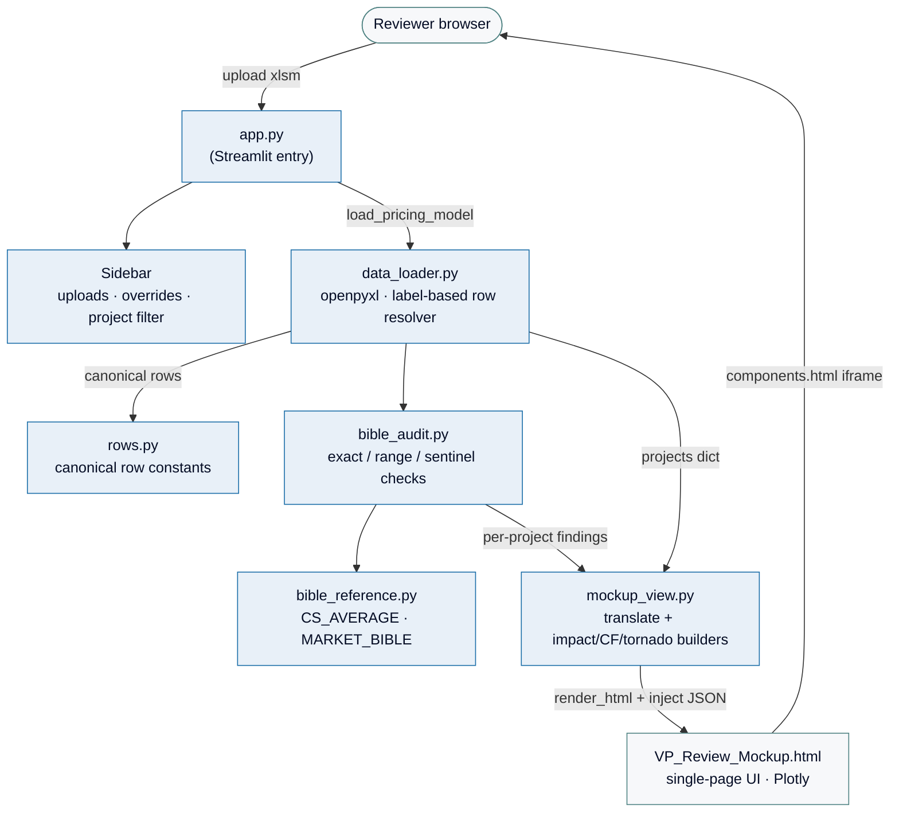

# 38DN VP Pricing Model Review

An investment-committee review tool for 38 Degrees North. A reviewer uploads a
pricing model (xlsm), the app audits each project against the Q1 2026 Pricing
Bible, and renders findings in an IC-ready HTML UI.

---

## Architecture



### Live modules
| File | Role |
|---|---|
| `app.py` | Streamlit entry; sidebar, project filter UI, iframe host |
| `mockup_view.py` | Real-data → mockup-schema translator, impact / cashflow / tornado / capital stack builders, HTML template injection |
| `VP_Review_Mockup.html` | Self-contained single-page UI (Plotly, three modes: Portfolio / Deep-Dive / Reference) |
| `data_loader.py` | openpyxl workbook reader + label-based row resolver (`_build_row_mapping`, `ROW_LABEL_ALIASES`) |
| `bible_audit.py` | Per-project exact / range / sentinel audit against the bible |
| `bible_reference.py` | `CS_AVERAGE`, `CS_STATE_OVERRIDES`, `MARKET_BIBLE`, `lookup_market()` |
| `rows.py` | Single source of truth for canonical row constants (DC, EPC, ITC, …) |
| `config.py` | Bible benchmarks + residual legacy constants |
| `styles.py` | Streamlit CSS overrides (sidebar, run button) |
| `benchmark_store.py` | Persistent bible overrides saved by the reviewer |
| `utils.py` | Small shared helpers (`safe_float`) |

---

## Running

```bash
# 1. Install deps
pip install -r requirements.txt

# 2. Start Streamlit
streamlit run app.py
```

Then upload a `*.xlsm` pricing model in the left sidebar, tick the projects
to include in the review, and click **Run Review**.

### Environment variables

| Var | Purpose |
|---|---|
| `VP_MACRO_RUNNER_DIR` | Path to a local `excel_macro_runner` repo. When set and importable, the sidebar shows a "Load from Macro Runner" expander. Otherwise hidden. |
| `VP_MACRO_RUNNER_DB` | Default SQLite DB path inside the macro-runner expander. Defaults to empty. |

Neither is required. The app ships with no hardcoded user paths.

---

## Testing

```bash
pip install pytest
python -m pytest tests/ -q
```

Six test modules cover:

| File | Scope |
|---|---|
| `tests/test_bible_audit.py` | `_exact_check` tolerance / pct-vs-fraction / MISSING / sentinel; `_range_check` |
| `tests/test_data_loader.py` | `_labels_match` positive + negative cases (including the Customer / Customer Mgmt Esc false-positive that prompted the matcher tightening) |
| `tests/test_mockup_view.py` | `_safe_json` XSS defense (U+2028 + `</script>`), `_compute_impact` unit rules, `_roll_up` leverage scaling, `render_html` inject round-trip |
| `tests/test_filter_pipeline.py` | `list_candidate_projects → filter_projects → build_payload` consistency; placeholder-column rejection; MW total matches across layers |
| `tests/test_bible_reference.py` | `lookup_market` fuzzy matcher (MD/DE normalization, utility containment) |
| `tests/test_mockup_builders.py` | `_build_capital_stack` (illustrative flag, DSCR hint, ITC=0 zeros TE bar), `_build_cashflow` (25-yr shape, terminal defensibility, MACRS, rate-component fallback), `_build_sensitivity` (ranked by magnitude, ≤7 inputs, sign direction), `render_html` round-trip with JSON re-parse |

CI target: 100% pass, <1s wall time. **74 tests** today.

---

## Key design decisions

**Why embed an HTML mockup via `components.html()` rather than native
Streamlit?** The UI has complex interactive state (mode switching, sort-by-
worst, per-row override audit trail, reviewer notes) that Streamlit's rerun
model makes painful. Splitting the boundary at a single JSON payload keeps
Python focused on data + audit rules and lets the front end handle UX.

**Why does every numeric Excel label go through `_build_row_mapping`?**
Template row numbers drift between model versions. The resolver matches
labels in the left column and falls back to **None** (never the canonical
row, which would read unrelated cells). Aliases in `data_loader.ROW_LABEL_ALIASES`
cover known-good variants without loosening `_labels_match`.

**Why is `_compute_impact` anchored to the bible EPC for ITC / eligible-cost
findings?** Otherwise an EPC delta would be double-counted through the
tax-credit math. The EPC finding already contributes its own impact; ITC /
eligible findings contribute only the pure tax-credit delta.

**Why are capital stack, cashflow, and tornado labelled "illustrative"?**
The underlying Python doesn't run the financial model; it derives these from
reasonable assumptions (55% debt, 85¢ TE monetization, 5-yr MACRS, 7% WACC
NPV dampener). Real values would require plugging the workbook into the
pricing-model macro runner. Illustrative labels + the reviewer-notes audit
trail keep intent explicit.

---

## Security notes

- Project strings from the uploaded workbook (project name, field labels,
  developer name, source text) are untrusted. Two layers of defense:
  - Python side: `_safe_json` neutralizes `</`, `<!--`, U+2028, U+2029 before
    embedding into a `<script>` block.
  - JS side: every `innerHTML` interpolation of untrusted strings goes through
    `_esc()`.
- The component is rendered in a sandboxed iframe — Streamlit Cloud host
  cookies are not visible to the payload.
- No secrets live in the repo. Macro-runner paths are opt-in via env vars.
- `.gitignore` excludes `.streamlit/secrets.toml`, `*.xlsm`, `*.xlsx`, `.env`,
  and the local `results.db`.

---

## Onboarding a new engineer

1. Clone + `pip install -r requirements.txt`.
2. Skim `rows.py` to understand the row-number convention.
3. Read `mockup_view._build_mockup_project` — that's the single function that
   wires every per-project data product.
4. Read `VP_Review_Mockup.html:selectProject` — that's the JS counterpart that
   consumes the payload.
5. Run the tests. Any failure means a data shape contract broke.
