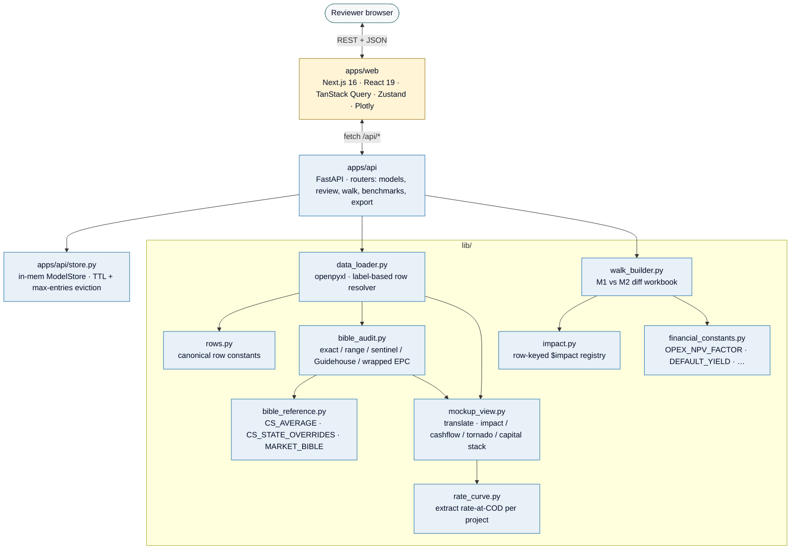

# 38DN Pricing Model Review

Internal review tool for 38 Degrees North M&A. A reviewer uploads a pricing
model (`.xlsm`), the FastAPI backend audits each project against the Q1 2026
Pricing Bible, and the Next.js SPA renders the findings.

Caroline-only tool. Hosted locally; uploaded workbook bytes never leave
the machine (per `pricing-workflow.md §7`, the model itself is strictly
internal to 38DN).

---

## Architecture



### Repo layout

| Path | Role |
|---|---|
| `apps/api/` | FastAPI service (Python). Routers under `apps/api/routers/`. Local model store with TTL eviction in `apps/api/store.py`. |
| `apps/web/` | Next.js 16 + React 19 + TypeScript SPA. Views: PortfolioView, ProjectReviewView, BuildWalkView, ReferencePanel, BibleMapping. Charts: CapitalStack, Cashflow, Heatmap, Tornado, Variance. Stores: `portfolio`, `reviewer`, `ui` (Zustand). |
| `lib/` | Pure-Python audit + workbook logic. No web framework dependencies — consumed by both `apps/api/` and (until Phase 6) `legacy/app.py`. |
| `legacy/` | Streamlit-based v0 UI. Parked; will be deleted once the SPA covers all functionality. Broken imports under refactor — do not run. |
| `tests/` | 16 test files covering the lib + api surface. 253 tests. |
| `docs/` | Design docs and upgrade plan. |

---

## Running

### Backend (FastAPI)

```powershell
# One-time: install deps from the lockfile
uv sync

# Start the API on http://localhost:8000
uv run uvicorn apps.api.main:app --reload
```

OpenAPI docs: <http://localhost:8000/docs>.
Health check: <http://localhost:8000/api/health>.

### Frontend (Next.js)

```powershell
cd apps/web
npm install
npm run dev
```

SPA at <http://localhost:3000>. Talks to the API at `localhost:8000` (CORS allowed in dev).

### Docker (optional)

```powershell
docker compose up --build
```

Brings up the API at `localhost:8000`. The SPA still runs separately via `npm run dev`.

### Environment variables

| Var | Purpose | Default |
|---|---|---|
| `VP_LOG_LEVEL` | Python logging level | `INFO` |
| `VP_MACRO_RUNNER_DIR` | Path to a local `excel_macro_runner` repo (legacy Streamlit only) | unset |
| `VP_MACRO_RUNNER_DB` | Default SQLite DB path for macro-runner integration | unset |

---

## Testing

```powershell
# All checks (mirrors CI)
uv run ruff check .
uv run ruff format --check .
uv run mypy lib apps
uv run pytest tests/
uv run bandit -c pyproject.toml -r lib apps --severity-level medium
```

253 tests, ~2 seconds wall time. CI runs all of the above on every push.

Run pre-commit hooks locally:

```powershell
uv run pre-commit install     # one-time
uv run pre-commit run --all-files
```

---

## Key design decisions

**Why a FastAPI + Next.js split rather than a monolithic Streamlit app?**
Streamlit's rerun-on-widget model fights stateful interaction (mode switching, sort-by-worst, override audit trail, reviewer notes). A clean HTTP boundary keeps Python focused on data + audit rules and lets the frontend handle UX. The legacy Streamlit shell remains under `legacy/` until the SPA covers every workflow.

**Why does every numeric Excel label go through `_build_row_mapping`?**
Template row numbers drift between model versions. `lib/data_loader._build_row_mapping` matches labels in the left column and falls back to `None` (never the canonical row, which would read unrelated cells). Aliases in `ROW_LABEL_ALIASES` cover known variants without loosening the matcher.

**Why is `lib/impact.py` a row-keyed registry rather than label-string matching?**
Each per-row impact formula maps a model row to a `$impact` calculation. Keying by row number rather than label substring (`"upfront"`, `"itc"`) protects the math against bible relabels.

**Why are capital stack, cashflow, and tornado labelled "illustrative"?**
The Python code doesn't run the financial model — these are derived from reasonable assumptions (55% debt, 85¢ TE monetization, 5-yr MACRS, 7% WACC NPV dampener; see `lib/financial_constants.py`). Real values require the pricing-model macro runner. Illustrative labels + the reviewer-notes audit trail keep intent explicit.

**Why does `ModelStore` evict on TTL + max-entries?**
Uploaded workbooks are 5–10 MB and the parsed object graph is larger. Unbounded caching would OOM on repeated uploads. 20 entries × 1-hour TTL is the current safety margin.

---

## CI

GitHub Actions on every push + PR to `master`:

- **`python` job:** ruff lint + format check, mypy on `lib` and `apps`, pytest with coverage, bandit (medium+), pip-audit on locked production deps.
- **`web` job:** ESLint, `tsc --noEmit`, `next build`.
- **`docker` job:** builds the API image (no push) to catch Dockerfile regressions.

The lockfile (`uv.lock`) is the source of truth for Python dep versions. Update it with `uv lock` after any `pyproject.toml` change.

---

## Security notes

- Workbook strings (project name, developer name, field labels, source text) are untrusted. The legacy iframe-rendered path defends via `_safe_json` + `_esc()`; the SPA path defends via React's default JSX escaping. Don't introduce raw HTML interpolation in either path.
- Uploaded workbooks are size-capped at 50 MB by the `/api/models/upload` endpoint and only `.xlsm` / `.xlsx` extensions are accepted.
- Workbook bytes are held in process memory only — never written to disk by the app.
- `.gitignore` excludes `.streamlit/secrets.toml`, `*.xlsm`, `*.xlsx`, `*.xls`, `.env`, `results.db`, `benchmark_overrides.json`.

---

## Project status + roadmap

Phase 1 (foundations) is in flight. See `docs/upgrade-plan.md` for the full
7-week plan: golden-file regression tests → audit engine refactor →
bible upload + vintage flow → SQLite persistence → SPA polish →
delete `legacy/`.
